# Lab Manual #

## Setting up your Azure account ##

You may activate an Azure free trial at [https://azure.microsoft.com/en-us/free/](https://azure.microsoft.com/en-us/free/).  

If you have been given an Azure Pass to complete this lab, you may go to [http://www.microsoftazurepass.com/](http://www.microsoftazurepass.com/) to activate it.  Please follow the instructions at [https://www.microsoftazurepass.com/howto](https://www.microsoftazurepass.com/howto), which document the activation process.  A Microsoft account may have **one free trial** on Azure and one Azure Pass associated with it, so if you have already activated an Azure Pass on your Microsoft account, _you will need to use the free trial or use another Microsoft account._

## Navigating the Solutions ##

There are two main top-level directories:

- **Starting**: This contains _skeleton_ code with parts missing that serves as the baseline for the tutorial. You should _start_ here.
- **Finished**: We have included the _finished_ solution, so that you can examine our take on what the code should look like. If you fall behind during the tutorial session, feel free to take code from here and use it in your solution.

In both, we have created a Solution (.sln) which contains several different projects for Phase 1, let's take a high-level look at them:

- **ImageProcessingLibrary**: This is a Portable Class Library (PCL) containing helper classes for accessing the various Cognitive Services related to Vision, and some "Insights" classes for encapsulating the results.
- **ImageStorageLibrary**: Since DocumentDB does not (yet) support UWP, this is a non-portable library for accessing Blob Storage and DocumentDB.
- **TestApp**: A UWP application that allows you to load your images and call the various cognitive services on them, then explore the results. Useful for experimentation and exploration of your images.
- **TestCLI**: A Console application allowing you to call the various cognitive services and then upload the images and data to Azure. Images are uploaded to Blob Storage, and the various metadata (tags, captions, faces) are uploaded to DocumentDB.

Both _TestApp_ and _TestCLI_ contain a `settings.json` file containing the various keys and endpoints needed for accessing the Cognitive Services and Azure. They start blank, so once you get your Azure Pass up and running we can provision your service keys and set up your storage account and DocumentDB instance.

**Finished** also contains a `PictureBot.sln` in the `PictureBot` directory. This is for Phase 3, where we integrate our Search Index into the Bot Framework.

> If you don't have Visual Studio installed, no problem! See [the Appendix](./LabManual.html#Appendix) for details on setting up a Visual Studio VM in Azure.

## Navigating the Azure portal ##

After creating an Azure account, you may access the Azure portal at https://portal.azure.com.  

## Getting Cognitive Services API Keys ##

Within the Portal, we'll first create keys for the Cognitive Services we'll be using. We'll primarily be using different APIs under the [Computer Vision](https://www.microsoft.com/cognitive-services/en-us/computer-vision-api) Cognitive Service, so let's create an API key for that first.

In the Portal, hit **New** and then enter **cognitive** in the search box and choose **Cognitive Services**:

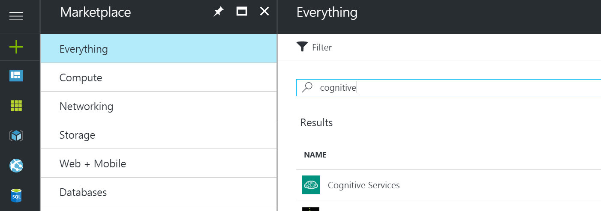

This will lead you to fill out a few details for the API endpoint you'll be creating, choosing the API you're interested in and where you'd like your endpoint to reside, as well as what pricing plan you'd like. We'll be using S1 so that we have the throughput we need for the tutorial, and creating a new _Resource Group_. We'll be using this same resource group below for our Blob Storage and DocumentDB, so pick something you like. _Pin to dashboard_ so that you can easily find it. Since the Computer Vision API stores images internally at Microsoft (in a secure fashion) to help improve future Cognitive Services Vision offerings, you'll need to _Enable_ Account creation. This can be a stumbling block for users in Enterprise environment, as only Subscription Administrators have the right to enable this, but for Azure Pass users it's not an issue.

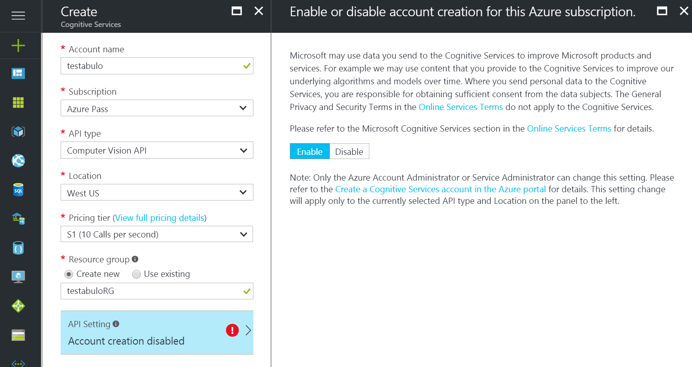 

Once you have created your new API subscription, you can grab the keys from the appropriate section of the blade, and add them to your _TestApp's_ and _TestCLI's_ `settings.json` file.

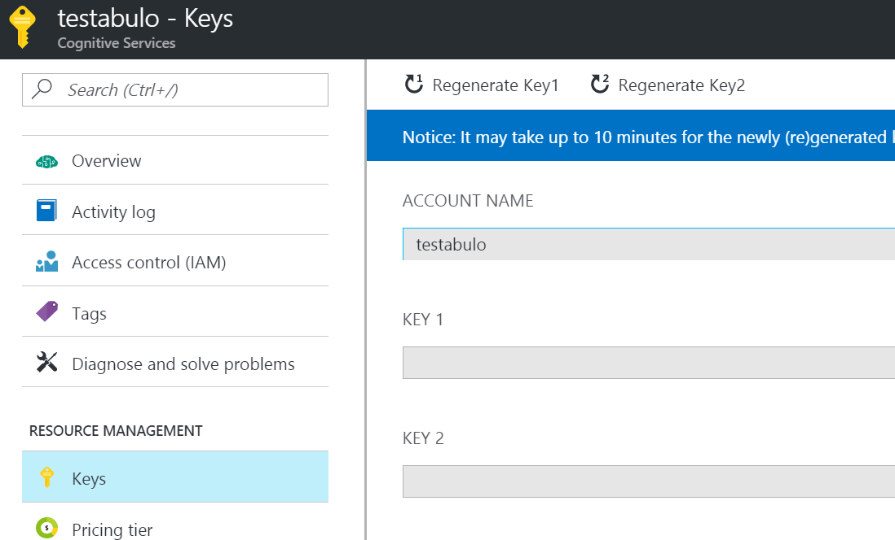

We'll also be using other APIs within the Computer Vision family, so take this opportunity to create API keys for the _Emotion_ and _Face_ APIs as well. They are created in the same fashion as above, and should re-use the same Resource Group you've created. _Pin to Dashboard_, and then add those keys to your `settings.json` files.

Since we'll be using [LUIS](https://www.microsoft.com/cognitive-services/en-us/language-understanding-intelligent-service-luis) later in the tutorial, let's take this opportunity to create our LUIS subscription here as well. It's created in the exact same fashion as above, but choose Language Understanding Intelligent Service from the API drop-down, and re-use the same Resource Group you created above. Once again, _Pin to Dashboard_ so once we get to that stage of the tutorial you'll find it easy to get access.  

## Setting up Storage ##

We'll be using two different stores in Azure for this project - one for storing the raw images, and the other for storing the results of our Cognitive Service calls. Azure Blob Storage is made for storing large amounts of data in a format that looks similar to a file-system, and is a great choice for storing data like images. Azure DocumentDB is our resilient NoSQL PaaS solution, and is incredibly useful for storing loosely structured data like we have with our image metadata results. There are other possible choices (Azure Table Storage, SQL Server), but DocumentDB gives us the flexibility to evolve our schema freely (like adding data for new services), query it easily, and can be quickly integrated into Azure Search.

### Azure Blob Storage ###

Detailed "Getting Started" instructions can be [found online](https://docs.microsoft.com/en-us/azure/storage/storage-dotnet-how-to-use-blobs), but let's just go over what you need for this lab.

Within the Azure Portal, click **New->Storage->Storage Account**


Once you click it, you'll be presented with the fields above to fill out. Choose your storage account name (lowercase letters and numbers), set _Account kind_ to _Blob storage_, _Replication_ to _Locally-Redundant storage (LRS)_ (this is just to save money), use the same Resource Group as above, and set _Location_ to _West US_.  (The list of Azure services that are available in each region is at https://azure.microsoft.com/en-us/regions/services/.) _Pin to dashboard_ so that you can easily find it.

Now that you have an Azure Storage account, let's grab the _Connection String_ and add it to your _TestCLI_ `settings.json`.


### DocumentDB ###

Detailed "Getting Started" instructions can be [found online](https://docs.microsoft.com/en-us/azure/documentdb/documentdb-get-started), but we'll walk through what you need for this project here.

Within the Azure Portal, click **New->Databases->NoSQL (DocumentDB)**.


Once you click this, you'll have to fill out a few fields as you see fit. 


In our case, select the ID you'd like, subject to the constraints that it needs to be lowercase letters, numbers, or dashes. We will be using the DocumentDB SDK and not Mongo, so select DocumentDB as the NoSQL API. Let's use the same Resource Group as we used for our previous steps, and the same location, select _Pin to dashboard_ to make sure we keep track of it and it's easy to get back to, and hit Create.

Once creation is complete, open the panel for your new database and select the _Keys_ sub-panel.


You'll need the **URI** and the **PRIMARY KEY** for your _TestCLI's_ `settings.json` file, so copy those into there and you're now ready to store images and data into the cloud.

## Exploring Cognitive Services and Image Processing Library ##

When you open the `ImageProcessing.sln` solution, from either the `Starting` or `Finished` directory, you will find a UWP application (`TestApp`) that allows you to load your images and call the various cognitive services on them, then explore the results. It is useful for experimentation and exploration of your images. This app is built on top of the `ImageProcessingLibrary` project, which is also what is used  by the TestCLI project to analyze the images.

Before running the app make sure to enter the Cognitive Services API keys in the `settings.json` file under the `TestApp` project. Once you do that, run the app, point it to any folder with images (via the `Select Folder` button), and it should generate results like the following, showing all the images it processed, along with a break down of unique faces, emotions and tags that also act as filters on the image collection.


Once the app processes a given directory it will cache the resuls in a `ImageInsights.json` file in that same folder, allowing you to look at that folder results again without having to call the various APIs. 

## Exploring DocumentDB ##

### TestCLI ###

We have implemented the main processing and storage code as a command-line/console application - both because I (Mike Lanzetta) am a terrible designer, and because this allows you to concentrate on the processing code without having to worry about event loops, forms, or any other UX related distractions. Feel free to add your own UX later - and as mentioned we accept Pull Requests :)

Once you've set your Cognitive Services API keys, your Azure Blob Storage Connection String, and your DocumentDB Endpoint URI and Key in your _TestCLI's_ `settings.json`, you can run the _TestCLI_. See below's _"Loading Image Using TestCLI"_ if you'd like to run it first - for now it will just connect to Blob Storage and Document DB, and print out the actions it _should be_ taking for each file you give it to process. It's your job to implement those actions, which we walk you through below.

### Implementing DocumentDBHelper ###

With `ImageProcessing.sln` from the `Starting` directory open, look in the `ImageStorageLibrary` project for the `DocumentDBHelper.cs` class. Take a look for `NotImplementedException` and you'll notice quite a few in the file. These are _suggested_ operations - feel free to implement different ones instead if they suit your needs. Many of the implementations can be found in the [Getting Started guide](https://docs.microsoft.com/en-us/azure/documentdb/documentdb-get-started).

Once you've implemented the operations in the helper, go to `TestCLI`'s `Util.cs` and notice that the `ImageMetadata` class has some gaps. We need to turn the `ImageInsights` we retrieve from Cognitive Services into appropriate Metadata to be stored into DocumentDB.

Finally, look in `Program.cs` and notice in `ProcessDirectoryAsync` there's a few `TODO` comments. First, we need to check if the image and metadata have already been uploaded - we can use `DocumentDBHelper` to find the document by ID - you should have implemented that above, to return `null` if the document doesn't exist. Next, if we've set `forceUpdate` or the image hasn't been processed before, we'll call the Cognitive Services using `ImageProcessor` from the `ImageProcessingLibrary` and retrieve the `ImageInsights`, which we add to our current `ImageMetadata`. 

Once that's complete, we can store our image - first the actual image into Blob Storage using our `BlobStorageHelper` instance, and then the `ImageMetadata` into Document DB using our `DocumentDBHelper` instance. If the document already existed (based on our previous check), we should update the existing document. Otherwise, we should be creating a new one.

### Loading Images Using TestCLI ###

Now that you've fixed all of the missing pieces above, you're ready to go. Build _TestCLI_, and run it:

    > .\bin\Debug\TestCLI.exe

    Usage:  [options]

    Options:
    -force            Use to force update even if file has already been added.
    -settings         The settings file (optional, will use embedded resource settings.json if not set)
    -process          The directory to process
    -query            The query to run
    -? | -h | --help  Show help information

By default, it will load your settings from `settings.json` (it builds it into the `.exe`), but you can provide your own using the `-settings` flag. To load images (and their metadata from Cognitive Services) into your cloud storage, you can just tell _TestCLI_ to `-process` your image directory as follows:

    > .\bin\Debug\TestCLI.exe -process c:\my\image\directory

Once it's done processing, you can query against your DocumentDB directly using _TestCLI_ as follows:

    > .\bin\Debug\TestCLI.exe -query "select * from images"

### Document DB Data Explorer ###

Head back to the portal and navigate to your Document DB instance. Now that you've loaded data into your collection, you can use Document DB's _Data Explorer_ (currently in Preview) to navigate your data. Click on _Data Explorer_, then _Documents_ and select a _Document_ to see the payload. 


Now click on _New Query_. It should start up with `SELECT * from c` in the query window. Let's play around with the query syntax - take a look at the [DocumentDB SQL syntax reference](https://msdn.microsoft.com/en-us/library/azure/dn782250.aspx). We know from the sample images that several contain a man or woman, so let's look for those:

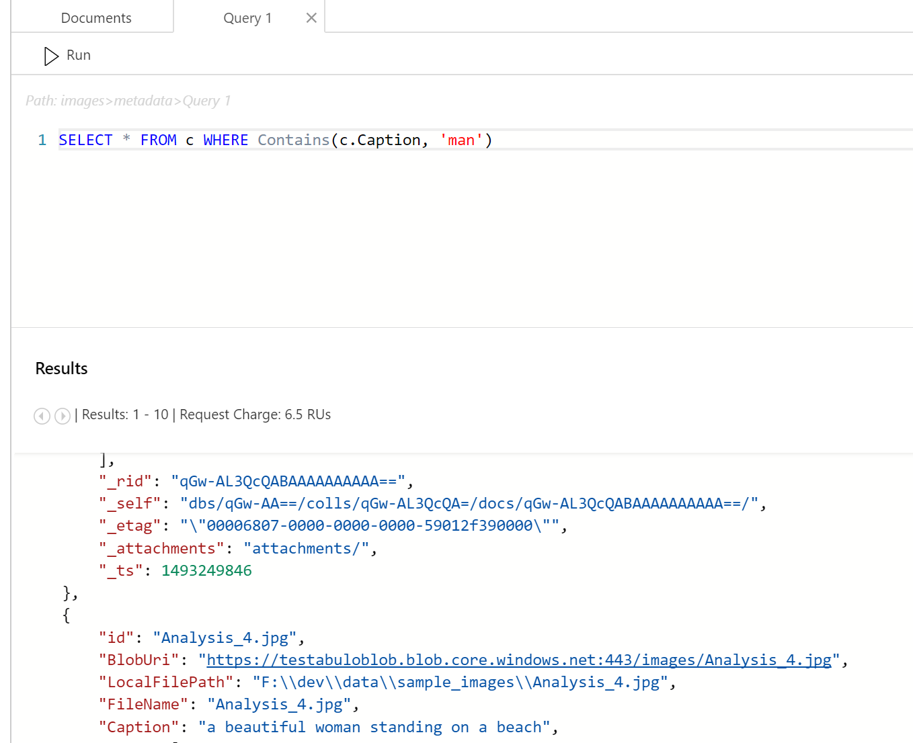

Feel free to experiment with the syntax.

### Finished Early ###

#### Extra Credit 1 ####

What if we needed to port our application to another language? Modify your code to call the [Translator API](https://azure.microsoft.com/en-us/services/cognitive-services/translator-text-api/) on the caption and tags you get back from the Vision service.

Look into the _Image Processing Library_ at the _Service Helpers_. You can copy one of these and use it to invoke the [Translator API](https://docs.microsofttranslator.com/text-translate.html). Now you can hook this into the `ImageProcessor.cs`. Try adding translated versions to your `ImageInsights` class, and then wire it through to the DocuementDB `ImageMetadata` class. 

## Building an Azure Search Index ## 

### Create an Azure Search Service ### 

Within the Azure Portal, click **New->Web + Mobile->Azure Search**.

Once you click this, you'll have to fill out a few fields as you see fit. For this lab, a "Free" tier is sufficient.

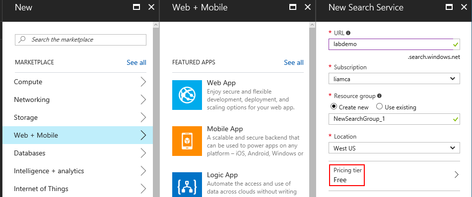

Once creation is complete, open the panel for your new search service.

### Create an Azure Search Index ### 

An Index is the container for your data and is a similar concept to that of a SQL Server table.  Like a table has rows, an Index has documents.  Like a table that has fields, an Index has fields.  These fields can have properties that tell things such as if it is full text searchable, or if it is filterable.  You can populate content into Azure Search by programatically [pushing content](https://docs.microsoft.com/en-us/rest/api/searchservice/addupdate-or-delete-documents) or by using the [Azure Search Indexer](https://docs.microsoft.com/en-us/azure/search/search-indexer-overview) (which can crawl common datastores for data).

For this lab, we will use the [Azure Search Indexer for DocumentDB](https://docs.microsoft.com/en-us/azure/search/search-howto-index-documentdb) to crawl the data in the the DocumentDB container. 

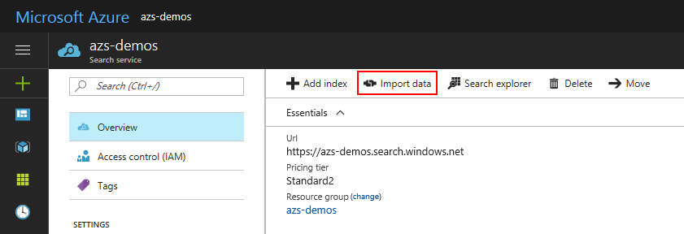 

Within the Azure Search blade you just created, click **Import Data->Data Source->DocumentDB**.

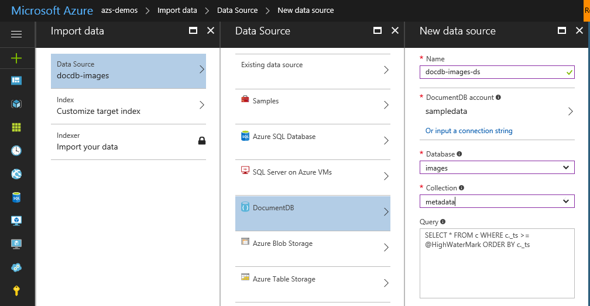 

Once you click this, choose a name for the DocumentDB datasource and choose the DocumentDB account where your data resides as well as the cooresponding Container and Collections.  

Click **OK**.

At this point Azure Search will connect to your DocumentDB container and analyze a few documents to identify a default schema for your Azure Search Index.  After this is complete, you can set the properties for the fields as needed by your application.

Update the Index name to: **images**

Update the Key to: **rid** (which uniquely identifies each document)

Set all fields to be **Retrievable** (to allow the client to retrieve these fields when searched)

Set the fields **Tags, NumFaces, and Faces** to be **Filterable** (to allow the client to filter results based on these values)

Set the field **NumFaces** to be **Sortable** (to allow the client to sort the results based on the number of faces in the image)

Set the fields **Tags, NumFaces, and Faces** to be **Facetable** (to allow the client to group the results by count, for example for your search result, there were "5 pictures that had a Tag of "beach")

Set the fields **Caption, Tags, and Faces** to be **Searchable** (to allow the client to do full text search over the text in these fields)

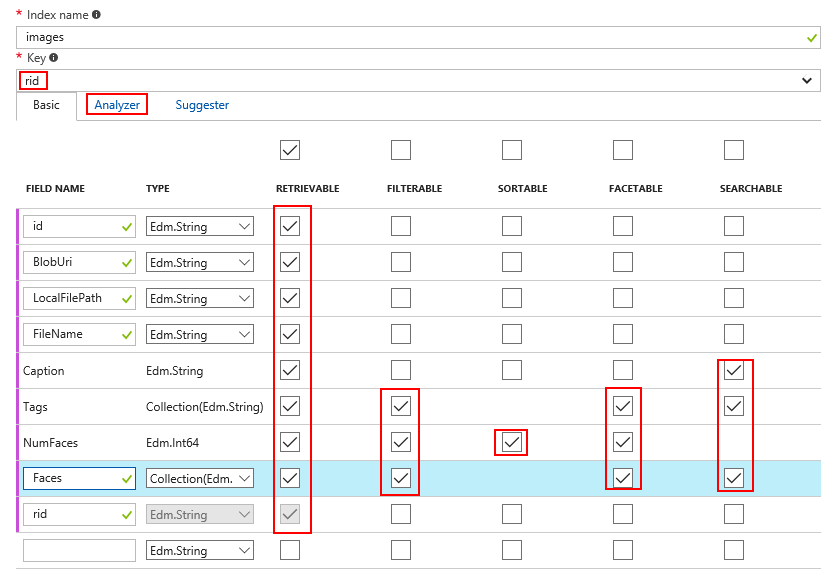 

At this point we will configure the Azure Search Analyzers.  At a high level, you can think of an analyzer as the thing that takes the terms a user enters and works to find the best matching terms in the Index.  Azure Search includes analyzers that are used in technologies like Bing and Office that have deep understanding of 56 languages.  

Click the **Analyzer** tab and set the fields **Caption, Tags, and Faces** to use the **English-Microsoft** analyzer

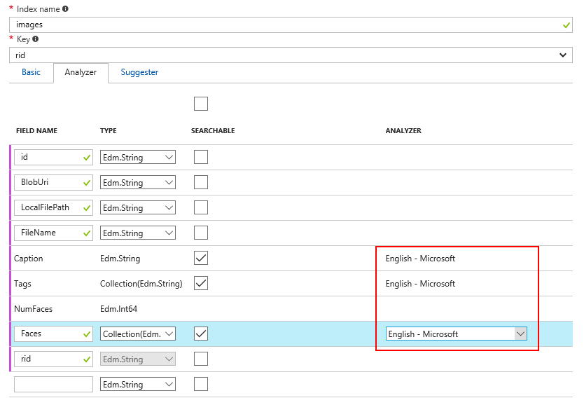 

For the final Index configuration step we will set the fields that will be used for type ahead, allowing the user to type parts of a word where Azure Search will look for best matches in these fields

Click the **Suggester** tab and enter a Suggester Name: **sg** and choose **Tags and Faces** to be the fields to look for term suggestions

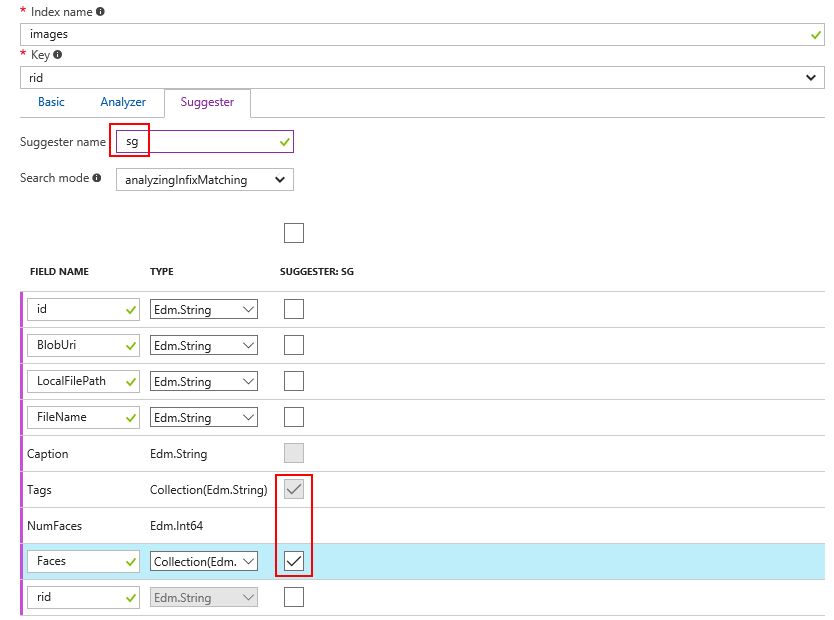 

Click **OK** to complete the configuration of the Indexer.  You could set at schedule for how often the Indexer should check for changes, however, for this lab we will just run it once.  

Click **Advanced Options** and choose to **Base 64 Encode Keys** to ensure that the RID field only uses characters supported in the Azure Search key field.

Click **OK, three times** to start the Indexer job that will start the importing of the data from the DocumentDB database.

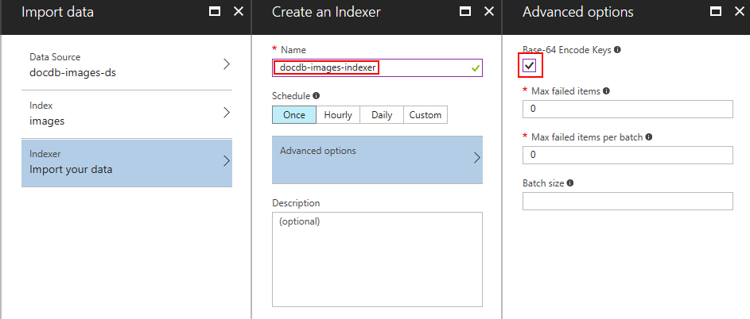 

***Query the Search Index***

You should see a message pop up indicating that Indexing has started.  If you wish to check the status of the Indexer, you can choose the "Indexer" option in the main Azure Search blade.

At this point we can try searching the index.  

Click **Search Explorer** and in the resulting blade choose your Index if it is not already selected.

Click **Search** to search for all documents.

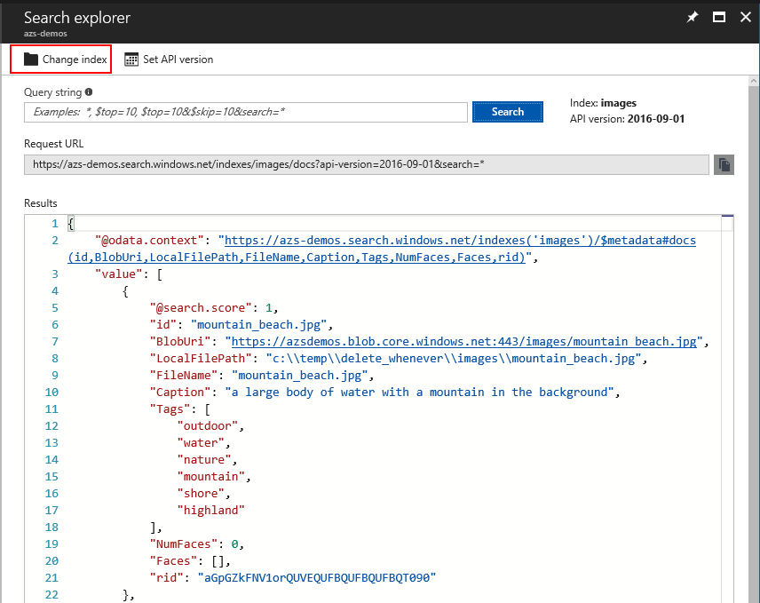 


## Building a Bot ##

### Setting up for Bot Development ###

We will be developing a bot using the C# SDK.  To get started, you need two things:
1. The Bot Framework project template, which you can download from http://aka.ms/bf-bc-vstemplate.  The file is called "Bot Application.zip" and you should save it into the &lt;Documents&gt;\Visual Studio 2015\Templates\ProjectTemplates\Visual C#\ directory (_note: if you're on VS2017, adjust the path accordingly_).  Just drop the whole zipped file in there; no need to unzip.  
2. Download the Bot Framework Emulator for testing your bot locally from https://emulator.botframework.com/.  

### Create a Simple Bot ###

In Visual Studio, go to File --> New Project and create a Bot Application.  You can name it "PictureBot" or something similar.  

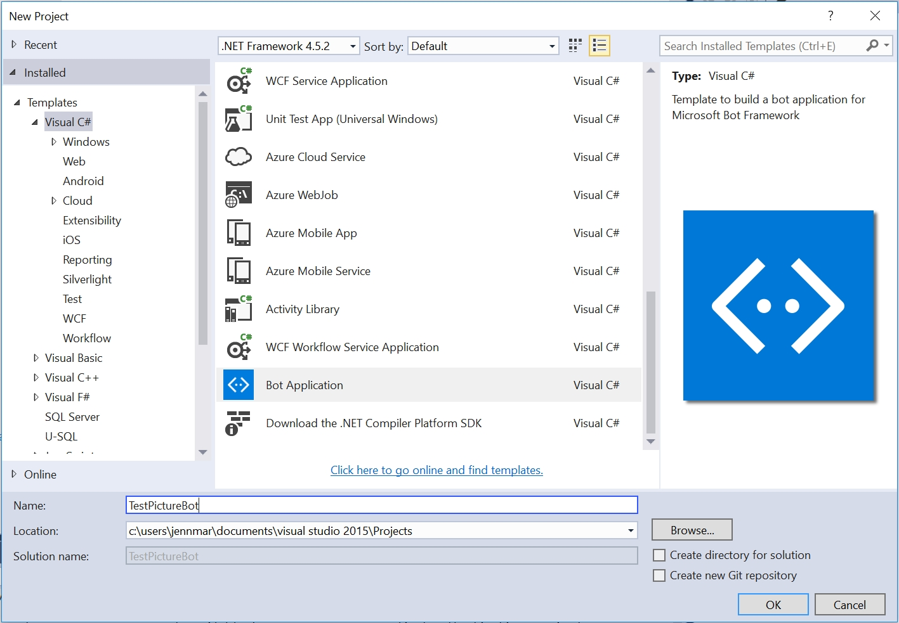 

Browse around and examine the sample bot code, which is an echo bot that repeats back your message and its length in characters.  In particular, note:
+ In **WebApiConfig.cs** under App_Start, the route template is api/{controller}/{id} where the id is optional.  That is why we always call the bot's endpoint with api/messages appended at the end.  
+ The **MessagesController.cs** under Controllers is therefore the entry point into your bot.  Notice that a bot can respond to many different activity types, and sending a message will invoke the RootDialog.  
+ In **RootDialog.cs** under Dialogs, "StartAsync" is the entry point which waits for a message from the user, and "MessageReceivedAsync" is the method that will handle the message once received and then wait for further messages.  We can use "context.PostAsync" to send a message from the bot back to the user.  

### Run the Bot ###

Click F5 to run the sample code.  NuGet should take care of downloading the appropriate dependencies.  

The code will launch in your default web browser in a URL similar to http://localhost:3979/.  

> Fun Aside: why this port number?  It is set in your project properties.  In your Solution Explorer, double-click "Properties" and select the "Web" tab.  The Project Url is set in the "Servers" section.  

 

Make sure your project is still running (hit F5 again if you stopped to look at the project properties) and launch the Bot Framework Emulator.  Ensure that the Bot Url matches the port number that your code launched in above, and has api/messages appended to the end.  Now you should be able to converse with the bot.  

 

### Add Intelligence to your Bot with LUIS ###

Now let's expand this bot to integrate with our picture scenario.  We can give it some natural language capabilities with the [Language Understanding Intelligent Service](https://www.luis.ai/), or LUIS.  LUIS allows you to map natural language utterances to intents.  For our application, we might have several intents: finding pictures, sharing pictures, and ordering prints of pictures, for example.  We can give a few example utterances as ways to ask for each of these things, and LUIS will map additional new utterances to each intent based on what it has learned.  

Navigate to https://www.luis.ai and sign in using your Microsoft account.  (This should be the same account that you used to create the Cognitive Services keys at the beginning of this lab.)  You should be redirected to a list of your LUIS applications at https://www.luis.ai/applications.  We will create a new LUIS app to support our bot.  

> Fun Aside: Notice that there is also an "Import App" next to the "New App" button on [the current page](https://www.luis.ai/applications).  After creating your LUIS application, you have the ability to export the entire app as JSON, and check it into source control.  This is a recommended best practice so you can version your LUIS models as you version your code.  An exported LUIS app may be re-imported using that "Import App" button.  If you fall behind during the lab and want to cheat, you can click the "Import App" button and import the [LUIS model from the Finished section](./Finished/LUIS/PictureBotLuisModel.json).  

From https://www.luis.ai/applications, click the "New App" button.  Give it a name (I chose "PictureBotLuisModel") and set the Culture to "English".  You can optionally provide a description.  Click the dropdown to select an endpoint key to use, and if the LUIS key that you created on the Azure portal at the beginning of this lab is there, select it.  Then click "Create".  

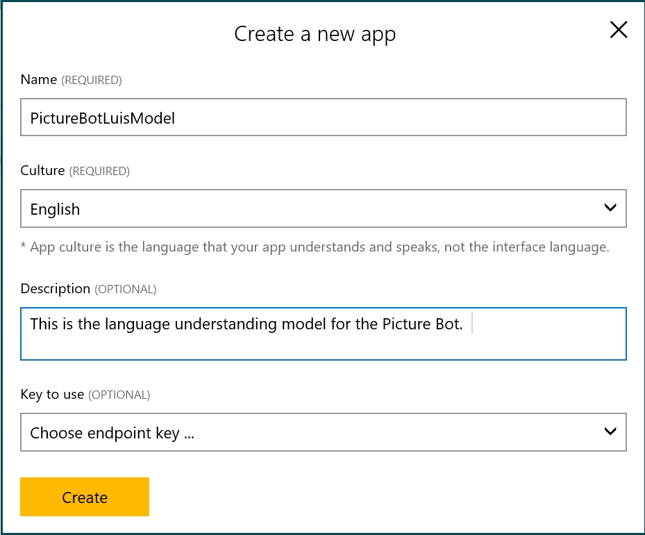 

You will be taken to a Dashboard for your new app.  The App Id is displayed; note that down for later as your **LUIS App ID**.  Then click "Create an intent".  

 

We want our bot to be able to do the following things:
+ Search/find pictures
+ Share pictures on social media
+ Order prints of pictures
+ Greet the user (although this can also be done other ways as we will see later)

Let's create intents for the user requesting each of these.  Click the "Add intent" button.  

Name the first intent "Greeting" and click "Save".  Then give several examples of things the user might say when greeting the bot, pressing "Enter" after each one.  After you have entered some utterances, click "Save".  

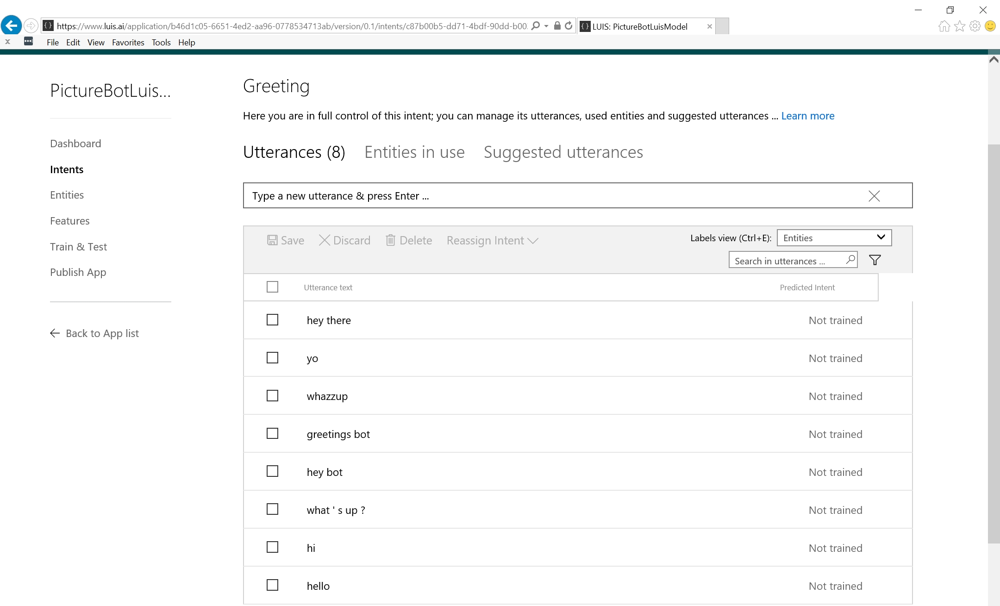 

Now let's see how to create an entity.  When the user requests to search the pictures, they may specify what they are looking for.  Let's capture that in an entity.  

Click on "Entities" in the left-hand column and then click "Add custom entity".  Give it an entity name "facet" and entity type "Simple".  Then click "Save".  

 

Now click "Intents" in the left-hand sidebar and then click the yellow "Add Intent" button.  Give it an intent name of "SearchPics" and then click "Save".  

Now let's add some sample utterances (words/phrases/sentences the user might say when talking to the bot).  People might search for pictures in many ways.  Feel free to use some of the utterances below, and add your own wording for how you would ask a bot to search for pictures.  

+ Find outdoor pics
+ Are there pictures of a train?
+ Find pictures of food.
+ Search for photos of a 6-month-old boy
+ Please give me pics of 20-year-old women
+ Show me beach pics
+ I want to find dog photos
+ Search for pictures of women indoors
+ Show me pictures of girls looking happy
+ I want to see pics of sad girls
+ Show me happy baby pics

Now we have to teach LUIS how to pick out the search topic as the "facet" entity.  Hover and click over the word (or drag to select a group of words) and then select the "facet" entity.  

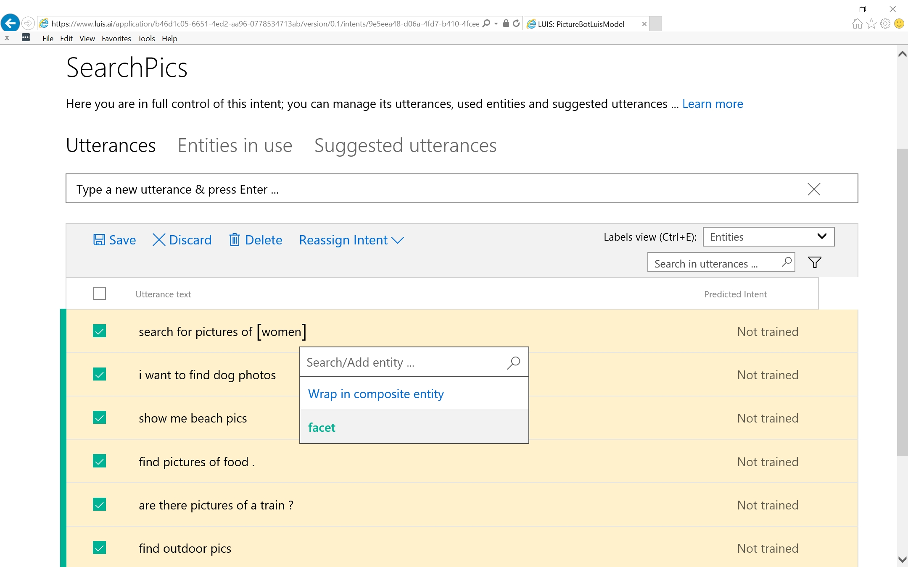 

So the following list of utterances...

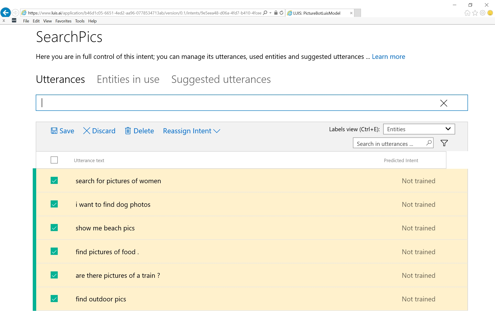 

...may become something like this when the facets are labelled.  

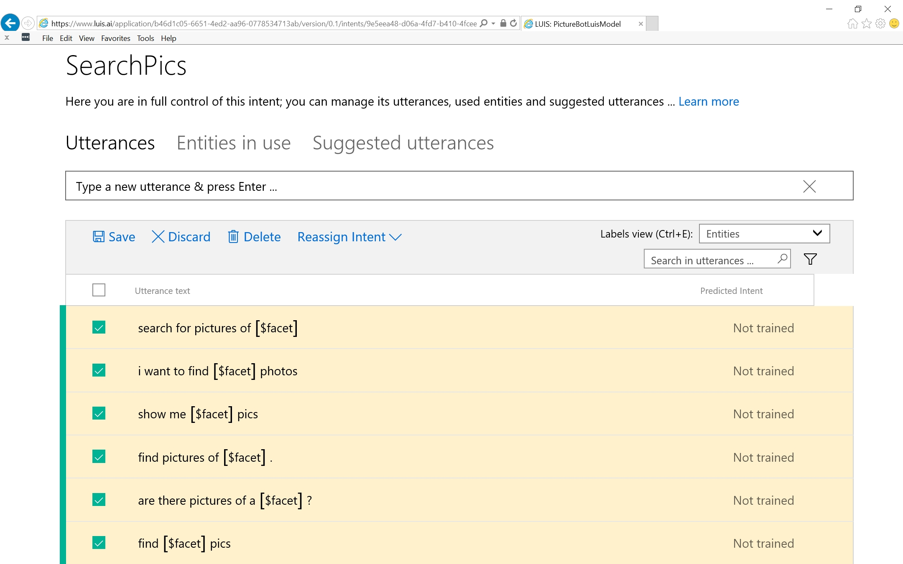 

Don't forget to click "Save" when you are done!  

Finally, click "Intents" in the left sidebar and add two more intents:
+ Name one intent **"SharePic"**.  This might be identified by utterances like "Share this pic", "Can you tweet that?", or "post to Twitter".  
+ Create another intent named **"OrderPic"**.  This could be communicated with utterances like "Print this picture", "I would like to order prints", "Can I get an 8x10 of that one?", and "Order wallets".  
When choosing utterances, it can be helpful to use a combination of questions, commands, and "I would like to..." formats.  

Note too that there is one intent called "None".  Random utterances that don't map to any of your intents may be mapped to "None".  You are welcome to seed it with a few, like "Do you like peanut butter and jelly?"

Now we are ready to train our model.  Click "Train & Test" in the left sidebar.  Then click the train button.  This builds a model to do utterance --> intent mapping with the training data you've provided.  

Then click on "Publish App" in the left sidebar.  If you have not already done so, select the endpoint key that you set up earlier, or follow the link to create a new key in your Azure account.  You can leave the endpoint slot as "Production".  Then click "Publish".  

 

Publishing creates an endpoint to call the LUIS model.  The URL will be displayed.  

Click on "Train & Test" in the left sidebar.  Check the "Enable published model" box to have the calls go through the published endpoint rather than call the model directly.  Try typing a few utterances and see the intents returned.  

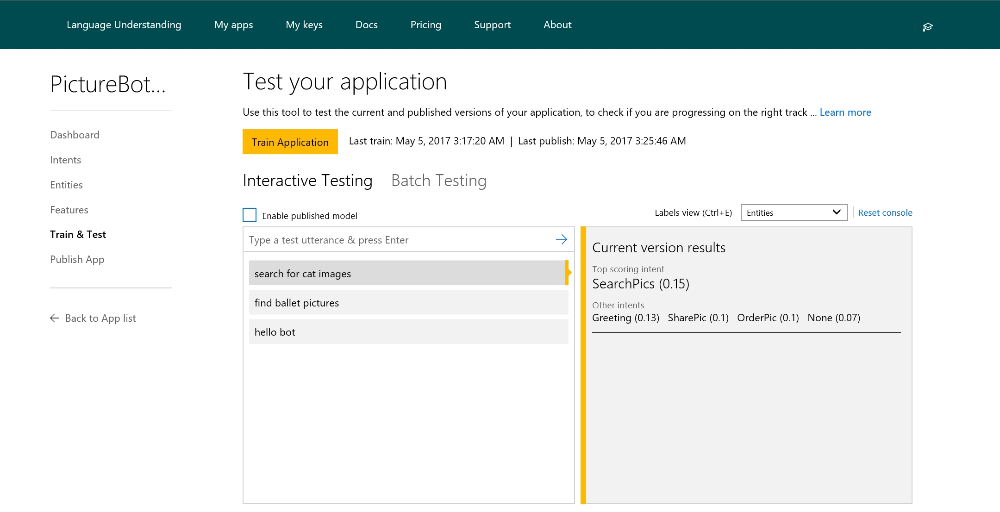 

> Extra credit (to complete later): Create additional entities that can be leveraged by the "SearchPics" intent.  Try creating a prebuilt entity for age.  Also explore using custom entities of entity type "List" to capture things like gender or emotion.  Don't forget to update your "SearchPics" intent to use these entities.  

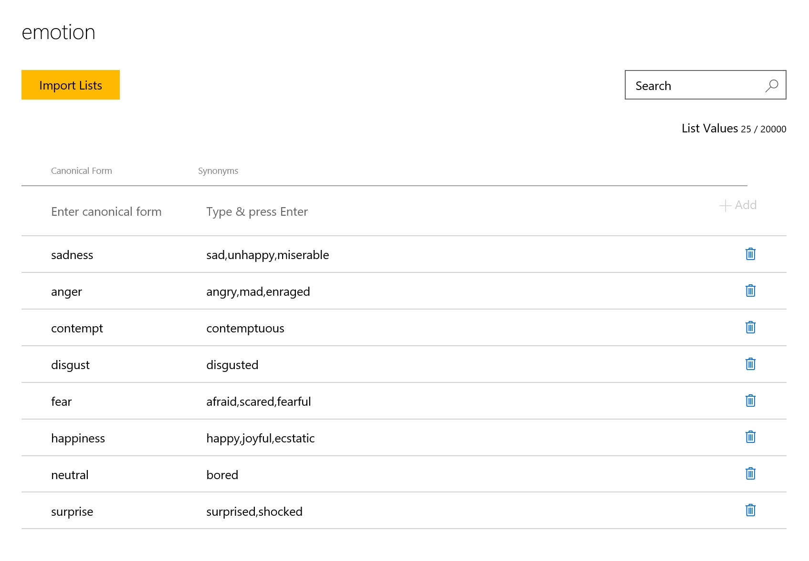 


### Update Bot to use LUIS ###

Now we want to update our bot to use LUIS.  We can do this by using the [LuisDialog class](https://docs.botframework.com/en-us/csharp/builder/sdkreference/d8/df9/class_microsoft_1_1_bot_1_1_builder_1_1_dialogs_1_1_luis_dialog.html).  

In the **RootDialog.cs** file, add references to the following namespaces:

```csharp

using Microsoft.Bot.Builder.Luis;
using Microsoft.Bot.Builder.Luis.Models;

```

Then, change the RootDialog class to derive from LuisDialog<object> instead of IDialog<object>.  Then, give the class a LuisModel attribute with the LUIS App ID and LUIS key.  (HINT: The LUIS App ID will have hyphens in it, and the LUIS key will not.  If you can't find these values, go back to http://luis.ai.  Click on your application, and the App ID is displayed right on the Dashboard page, as well as in the URL.  Then click on ["My keys" in the top sidebar](https://www.luis.ai/home/keys) to find your Endpoint Key in the list.)  

```csharp

using System;
using System.Threading.Tasks;
using Microsoft.Bot.Builder.Dialogs;
using Microsoft.Bot.Connector;
using Microsoft.Bot.Builder.Luis;
using Microsoft.Bot.Builder.Luis.Models;

namespace TestPictureBot.Dialogs
{
    [LuisModel("96f65e22-7dcc-4f4d-a83a-d2aca5c72b24", "1234bb84eva3481a80c8a2a0fa2122f0")]
    [Serializable]
    public class RootDialog : LuisDialog<object>
    {

```

> Fun Aside: You can use [Autofac](https://autofac.org/) to dynamically load the LuisModel attribute on your class instead of hardcoding it, so it could be stored properly in a configuration file.  There is an example of this in the [AlarmBot sample](https://github.com/Microsoft/BotBuilder/blob/master/CSharp/Samples/AlarmBot/Models/AlarmModule.cs#L24).  

Next, delete the two existing methods in the class (StartAsync and MessageReceivedAsync).  LuisDialog already has an implementation of StartAsync that will call the LUIS service and route to the appropriate method based on the response.  

Finally, add a method for each intent.  The corresponding method will be invoked for the highest-scoring intent.  We will start by just displaying simple messages for each intent.  

```csharp

        [LuisIntent("")]
        [LuisIntent("None")]
        public async Task None(IDialogContext context, LuisResult result)
        {
            await context.PostAsync("Hmmmm, I didn't understand that.  I'm still learning!");
        }

        [LuisIntent("Greeting")]
        public async Task Greeting(IDialogContext context, LuisResult result)
        {
            await context.PostAsync("Hello!  I am a Photo Organization Bot.  I can search your photos, share your photos on Twitter, and order prints of your photos.  You can ask me things like 'find pictures of food'.");
        }

        [LuisIntent("SearchPics")]
        public async Task SearchPics(IDialogContext context, LuisResult result)
        {
            await context.PostAsync("Searching for your pictures...");
        }

        [LuisIntent("OrderPic")]
        public async Task OrderPic(IDialogContext context, LuisResult result)
        {
            await context.PostAsync("Ordering your pictures...");
        }

        [LuisIntent("SharePic")]
        public async Task SharePic(IDialogContext context, LuisResult result)
        {
            await context.PostAsync("Posting your pictures to Twitter...");
        } 

```

Now, let's run our code.  Hit F5 to run in Visual Studio, and start up a new conversation in the Bot Framework Emulator.  Try chatting with the bot, and ensure that you get the expected responses.  If you get any unexpected results, note them down and we will revise LUIS.  

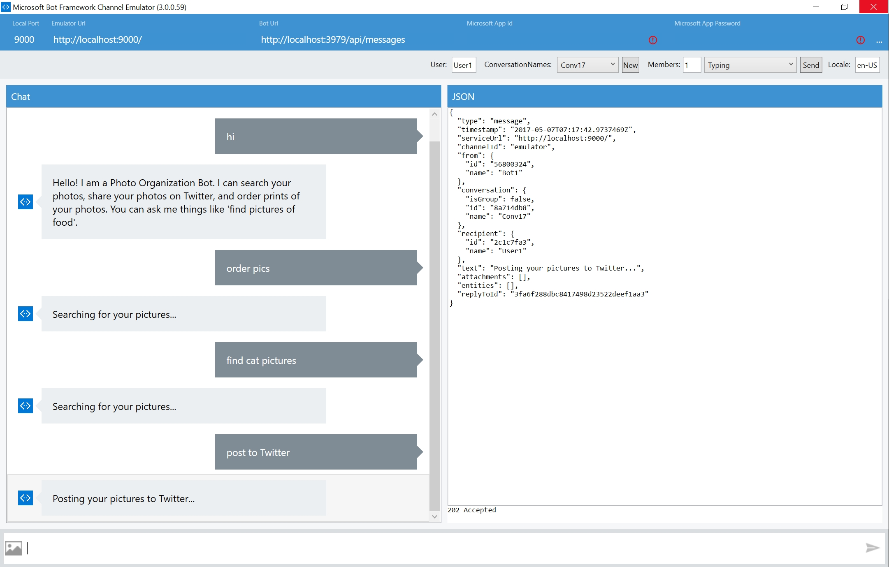 

In the above screenshot, I was expecting to get a different response when I said "order prints" to the bot.  It looks like this was mapped to the "SearchPics" intent instead of the "OrderPic" intent.  I can update my LUIS model by returning to http://luis.ai.  Click on the appropriate application, and then click on "Intents" in the left sidebar.  I could manually add this as a new utterance, or I could leverage the "suggested utterances" functionality in LUIS to improve my model.  Click on the "SearchPics" intent (or the one to which your utterance was mis-labelled) and then click "Suggested utterances".  Click the checkbox for the mis-labelled utterance, and then click "Reassign Intent" and select the correct intent.  

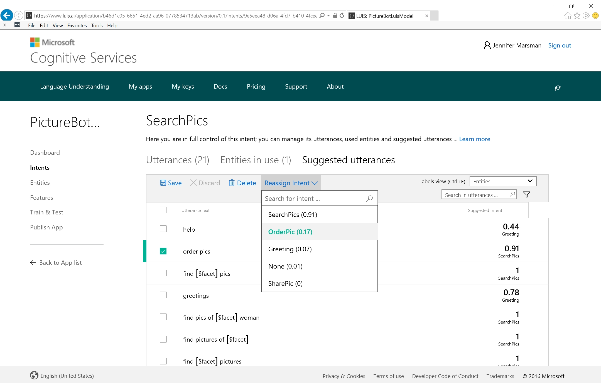 

For these changes to be picked up by your bot, you must re-train and re-publish your LUIS model.  Click on "Publish App" in the left sidebar, and click the "Train" button and then the "Publish" button near the bottom.  Then you can return to your bot in the emulator and try again.  

> Fun Aside: The Suggested Utterances are extremely powerful.  LUIS makes smart decisions about which utterances to surface.  It chooses the ones that will help it improve the most to have manually labelled by a human-in-the-loop.  For example, if the LUIS model predicted that a given utterance mapped to Intent1 with 47% confidence and predicted that it mapped to Intent2 with 48% confidence, that is a strong candidate to surface to a human to manually map, since the model is very close between two intents.  

Now that we can use our LUIS model to figure out the user's intent, let's integrate Azure search to find our pictures.  

### Configure for Azure Search ###

First, we need to provide our bot with the relevant information to connect to an Azure Search index.  The best place to store connection information is in the configuration file.  

Open Web.config and in the appSettings section, add the following:

```xml    
    <!-- Azure Search Settings -->
    <add key="SearchDialogsServiceName" value="" />
    <add key="SearchDialogsServiceKey" value="" />
    <add key="SearchDialogsIndexName" value="images" />
```

Set the value for the SearchDialogsServiceName to be the name of the Azure Search Service that you created earlier.  If needed, go back and look this up in the [Azure portal](https://portal.azure.com).  

Set the value for the SearchDialogsServiceKey to be the key for this service.  This can be found in the [Azure portal](https://portal.azure.com) under the Keys section for your Azure Search.  In the below screenshot, the SearchDialogsServiceName would be "aiimmersionsearch" and the SearchDialogsServiceKey would be "375...".  

 

### Update Bot to use Azure Search ###

Now, let's update the bot to call Azure Search.  First, open Tools-->NuGet Package Manager-->Manage NuGet Packages for Solution.  In the search box, type "Microsoft.Azure.Search".  Select the corresponding library, check the box that indicates your project, and install it.  It may install other dependencies as well.  

 

Right-click on your project in the Solution Explorer of Visual Studio, and select Add-->New Folder.  Create a folder called "Models".  Then right-click on the Models folder, and select Add-->Existing Item.  Do this twice to add these two files under the Models folder (make sure to adjust your namespaces if necessary):
1. [ImageMapper.cs from the Finished section](./Finished/PictureBot/Models/ImageMapper.cs)
2. [SearchHit.cs from the Finished section](./Finished/PictureBot/Models/SearchHit.cs)

Next, right-click on the Dialogs folder in the Solution Explorer of Visual Studio, and select Add-->Class.  Call your class "SearchDialog.cs".  Add this code:

```csharp

using System;
using System.Collections.Generic;
using System.Configuration;
using System.Linq;
using System.Threading.Tasks;
using Microsoft.Azure.Search;
using Microsoft.Azure.Search.Models;
using Microsoft.Bot.Builder.Dialogs;
using Microsoft.Bot.Connector;
using TestPictureBot.Models;

namespace TestPictureBot.Dialogs
{
    [Serializable]
    public class SearchDialog : IDialog<object>
    {
        private string searchText = "";

        public SearchDialog(string facet)
        {
            searchText = facet;
        }

        public async Task StartAsync(IDialogContext context)
        {
            ISearchIndexClient indexClientForQueries = CreateSearchIndexClient();

            // For more examples of calling search with SearchParameters, see
            // https://github.com/Azure-Samples/search-dotnet-getting-started/blob/master/DotNetHowTo/DotNetHowTo/Program.cs.  

            DocumentSearchResult results = await indexClientForQueries.Documents.SearchAsync(searchText);
            await SendResults(context, results);
        }

        private async Task SendResults(IDialogContext context, DocumentSearchResult results)
        {
            var message = context.MakeMessage();

            if (results.Results.Count == 0)
            {
                await context.PostAsync("There were no results found for \"" + searchText + "\".");
                context.Done<object>(null);
            }
            else
            {
                SearchHitStyler searchHitStyler = new SearchHitStyler();
                searchHitStyler.Apply(
                    ref message,
                    "Here are the results that I found:",
                    results.Results.Select(r => ImageMapper.ToSearchHit(r)).ToList().AsReadOnly());

                await context.PostAsync(message);
                context.Done<object>(null);
            }
        }

        private ISearchIndexClient CreateSearchIndexClient()
        {
            string searchServiceName = ConfigurationManager.AppSettings["SearchDialogsServiceName"];
            string queryApiKey = ConfigurationManager.AppSettings["SearchDialogsServiceKey"];
            string indexName = ConfigurationManager.AppSettings["SearchDialogsIndexName"];

            SearchIndexClient indexClient = new SearchIndexClient(searchServiceName, indexName, new SearchCredentials(queryApiKey));
            return indexClient;
        }

        [Serializable]
        public class SearchHitStyler : PromptStyler
        {
            public override void Apply<T>(ref IMessageActivity message, string prompt, IReadOnlyList<T> options, IReadOnlyList<string> descriptions = null)
            {
                var hits = options as IList<SearchHit>;
                if (hits != null)
                {
                    var cards = hits.Select(h => new HeroCard
                    {
                        Title = h.Title,
                        Images = new[] { new CardImage(h.PictureUrl) },
                        Text = h.Description
                    });

                    message.AttachmentLayout = AttachmentLayoutTypes.Carousel;
                    message.Attachments = cards.Select(c => c.ToAttachment()).ToList();
                    message.Text = prompt;
                }
                else
                {
                    base.Apply<T>(ref message, prompt, options, descriptions);
                }
            }
        }

    }
}

```

Finally, we need to update your RootDialog to call the SearchDialog.  In RootDialog.cs in the Dialogs folder, update the SearchPics method and add these "ResumeAfter" methods:

```csharp

        [LuisIntent("SearchPics")]
        public async Task SearchPics(IDialogContext context, LuisResult result)
        {
            // Check if LUIS has identified the search term that we should look for.  
            string facet = null;
            EntityRecommendation rec;
            if (result.TryFindEntity("facet", out rec)) facet = rec.Entity;

            // If we don't know what to search for (for example, the user said
            // "find pictures" or "search" instead of "find pictures of x"),
            // then prompt for a search term.  
            if (string.IsNullOrEmpty(facet))
            {
                PromptDialog.Text(context, ResumeAfterSearchTopicClarification,
                    "What kind of picture do you want to search for?");
            }
            else
            {
                await context.PostAsync("Searching pictures...");
                context.Call(new SearchDialog(facet), ResumeAfterSearchDialog);
            }
        }

        private async Task ResumeAfterSearchTopicClarification(IDialogContext context, IAwaitable<string> result)
        {
            string searchTerm = await result;
            context.Call(new SearchDialog(searchTerm), ResumeAfterSearchDialog);
        }

        private async Task ResumeAfterSearchDialog(IDialogContext context, IAwaitable<object> result)
        {
            await context.PostAsync("Done searching pictures");
        }

```

Press F5 to run your bot again.  In the Bot Emulator, try searching with "find dog pics" or "search for happiness photos".  Ensure that you are seeing results when tags from your pictures are requested.  

### Regular Expressions and Scorable Groups ###

There are a number of things that we can do to improve our bot.  First of all, we may not want to call LUIS for a simple "hi" greeting, which the bot will get fairly frequently from its users.  A simple regular expression could match this, and save us time (due to network latency) and money (due to cost of calling the LUIS service).  

Also, as the complexity of our bot grows, and we are taking the user's input and using multiple services to interpret it, we need a process to manage that flow.  For example, try regular expressions first, and if that doesn't match, call LUIS, and then perhaps we also drop down to try other services like [QnA Maker](http://qnamaker.ai) and Azure Search.  A great way to manage this is ScorableGroups.  ScorableGroups give you an attribute to impose an order on these service calls.  In our code, let's impose an order of matching on regular expressions first, then calling LUIS for interpretation of utterances, and finally lowest priority is to drop down to a generic "I'm not sure what you mean" response.    

To use ScorableGroups, your RootDialog will need to inherit from DispatchDialog instead of LuisDialog (but you can still have the LuisModel attribute on the class).  You also will need a reference to Microsoft.Bot.Builder.Scorables (as well as others).  So in your RootDialog.cs file, add:

```csharp

using Microsoft.Bot.Builder.Scorables;
using System.Collections.Generic;

```

and change your class derivation to:

```csharp

    public class RootDialog : DispatchDialog

```

Then let's add some new methods that match regular expressions as our first priority in ScorableGroup 0.  Add the following at the beginning of your RootDialog class:

```csharp

        [RegexPattern("^hello")]
        [RegexPattern("^hi")]
        [ScorableGroup(0)]
        public async Task Hello(IDialogContext context, IActivity activity)
        {
            await context.PostAsync("Hello from RegEx!  I am a Photo Organization Bot.  I can search your photos, share your photos on Twitter, and order prints of your photos.  You can ask me things like 'find pictures of food'.");
        }

        [RegexPattern("^help")]
        [ScorableGroup(0)]
        public async Task Help(IDialogContext context, IActivity activity)
        {
            // Launch help dialog with button menu  
            List<string> choices = new List<string>(new string[] { "Search Pictures", "Share Picture", "Order Prints" });
            PromptDialog.Choice<string>(context, ResumeAfterChoice, 
                new PromptOptions<string>("How can I help you?", options:choices));
        }

        private async Task ResumeAfterChoice(IDialogContext context, IAwaitable<string> result)
        {
            string choice = await result;
            
            switch (choice)
            {
                case "Search Pictures":
                    PromptDialog.Text(context, ResumeAfterSearchTopicClarification,
                        "What kind of picture do you want to search for?");
                    break;
                case "Share Picture":
                    await SharePic(context, null);
                    break;
                case "Order Prints":
                    await OrderPic(context, null);
                    break;
                default:
                    await context.PostAsync("I'm sorry. I didn't understand you.");
                    break;
            }
        }

```

This code will match on expressions from the user that start with "hi", "hello", and "help".  Notice that when the user asks for help, we present him/her with a simple menu of buttons on the three core things our bot can do: search pictures, share pictures, and order prints.  

> Fun Aside: One might argue that the user shouldn't have to type "help" to get a menu of clear options on what the bot can do; rather, this should be the default experience on first contact with the bot.  **Discoverability** is one of the biggest challenges for bots - letting the users know what the bot is capable of doing.  Good [bot design principles](https://docs.microsoft.com/en-us/bot-framework/bot-design-principles) can help.   

Now we will call LUIS as our second attempt if no regular expression matches, in Scorable Group 1.  

The "None" intent in LUIS means that the utterance didn't map to any intent.  In this situation, we want to fall down to the next level of ScorableGroup.  Modify your "None" method in the RootDialog class as follows:

```csharp

        [LuisIntent("")]
        [LuisIntent("None")]
        [ScorableGroup(1)]
        public async Task None(IDialogContext context, LuisResult result)
        {
            // Luis returned with "None" as the winning intent,
            // so drop down to next level of ScorableGroups.  
            ContinueWithNextGroup();
        }

```

On the "Greeting" method, add a ScorableGroup attribute and add "from LUIS" to differentiate.  When you run your code, try saying "hi" and "hello" (which should be caught by the RegEx match) and then say "greetings" or "hey there" (which may be caught by LUIS, depending on how you trained it).  Note which method responds.  

```csharp

        [LuisIntent("Greeting")]
        [ScorableGroup(1)]
        public async Task Greeting(IDialogContext context, LuisResult result)
        {
            // Duplicate logic, for a teachable moment on Scorables.  
            await context.PostAsync("Hello from LUIS!  I am a Photo Organization Bot.  I can search your photos, share your photos on Twitter, and order prints of your photos.  You can ask me things like 'find pictures of food'.");
        }

```

Then, add the ScorableGroup attribute to your "SearchPics" method and your "OrderPic" method.  

```csharp

        [LuisIntent("SearchPics")]
        [ScorableGroup(1)]
        public async Task SearchPics(IDialogContext context, LuisResult result)
        {
            ...
        }

        [LuisIntent("OrderPic")]
        [ScorableGroup(1)]
        public async Task OrderPic(IDialogContext context, LuisResult result)
        {
            ...
        }

```

> Extra credit (to complete later): create an OrderDialog class in your "Dialogs" folder.  Create a process for ordering prints with the bot using [FormFlow](https://docs.botframework.com/en-us/csharp/builder/sdkreference/forms.html).  Your bot will need to collect the following information: Photo size (8x10, 5x7, wallet, etc.), number of prints, glossy or matte finish, user's phone number, and user's email.

You can update your "SharePic" method as well.  This contains a little code to show how to do a prompt for a yes/no confirmation as well as setting the ScorableGroup.  This code doesn't actually post a tweet because we didn't want to spend time getting everyone set up with Twitter developer accounts and such, but you are welcome to implement if you want.  

```csharp

        [LuisIntent("SharePic")]
        [ScorableGroup(1)]
        public async Task SharePic(IDialogContext context, LuisResult result)
        {
            PromptDialog.Confirm(context, AfterShareAsync,
                "Are you sure you want to tweet this picture?");            
        }

        private async Task AfterShareAsync(IDialogContext context, IAwaitable<bool> result)
        {
            if (result.GetAwaiter().GetResult() == true)
            {
                // Yes, share the picture.
                await context.PostAsync("Posting tweet.");
            }
            else
            {
                // No, don't share the picture.  
                await context.PostAsync("OK, I won't share it.");
            }
        }

```

Finally, add a default handler if none of the above services were able to understand.  This ScorableGroup needs an explicit MethodBind because it is not decorated with a LuisIntent or RegexPattern attribute (which include a MethodBind).

```csharp

        // Since none of the scorables in previous group won, the dialog sends a help message.
        [MethodBind]
        [ScorableGroup(2)]
        public async Task Default(IDialogContext context, IActivity activity)
        {
            await context.PostAsync("I'm sorry. I didn't understand you.");
            await context.PostAsync("You can tell me to find photos, tweet them, and order prints.  Here is an example: \"find pictures of food\".");
        }

```

Hit F5 to run your bot and test it in the Bot Emulator.  

### Publish your bot ###

A bot created using the Microsoft Bot can be hosted at any publicly-accessible URL.  For the purposes of this lab, we will host our bot in an Azure website/app service.  

In the Solution Explorer in Visual Studio, right-click on your Bot Application project and select "Publish".  This will launch a wizard to help you publish your bot to Azure.  

Select the publish target of "Microsoft Azure App Service".  

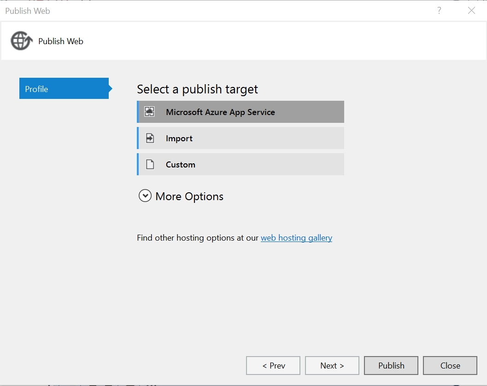 

On the App Service screen, select the appropriate subscription and click "New". Then enter an API app name, subscription, the same resource group that you've been using thus far, and an app service plan.  

 

Finally, you will see the Web Deploy settings, and can click "Publish".  The output window in Visual Studio will show the deployment process.  Then, your bot will be hosted at a URL like http://testpicturebot.azurewebsites.net/, where "testpicturebot" is the App Service API app name.  

### Register with the Bot Connector ###

Now, go to a web browser and navigate to http://dev.botframework.com.  Click [Register a bot](https://dev.botframework.com/bots/new).  Fill out your bot's name, handle, and description.  Your messaging endpoint will be your Azure website URL with "api/messages" appended to the end, like https://testpicturebot.azurewebsites.net/api/messages.  

 

Then click the button to create a Microsoft App ID and password.  This is your Bot App ID and password that you will need in your Web.config.  Store your Bot app name, app ID, and app password in a safe place!  Once you click "OK" on the password, there is no way to get back to it.  Then click "Finish and go back to Bot Framework".  

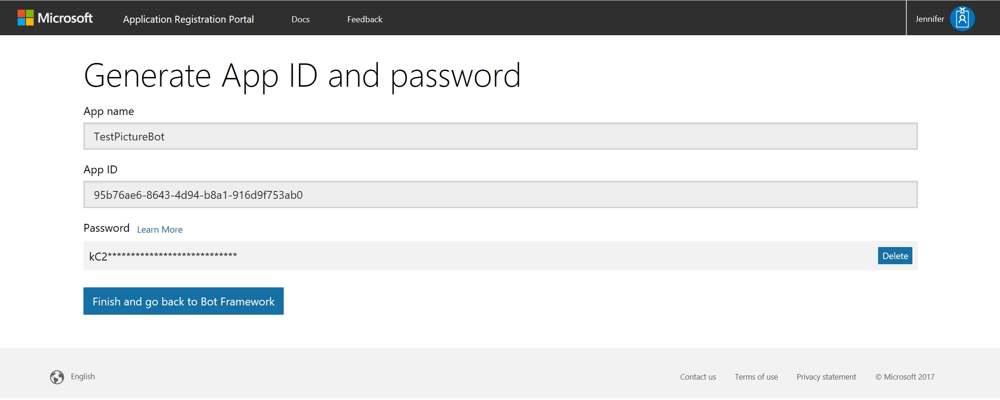 

On the bot registration page, your app ID should have been automatically filled in.  You can optionally add an AppInsights instrumentation key for logging from your bot.  Check the box if you agree with the terms of service and click "Register".  

You are then taken to your bot's dashboard page, with a URL like https://dev.botframework.com/bots?id=TestPictureBot but with your own bot name. This is where we can enable various channels.  Two channels, Skype and Web Chat, are enabled automatically.  

Finally, you need to update your bot with its registration information.  Return to Visual Studio and open Web.config.  Update the BotId with the App Name, the MicrosoftAppId with the App ID, and the MicrosoftAppPassword with the App Password that you got from the bot registration site.  

```xml

    <add key="BotId" value="TestPictureBot" />
    <add key="MicrosoftAppId" value="95b76ae6-8643-4d94-b8a1-916d9f753ab0" />
    <add key="MicrosoftAppPassword" value="kC200000000000000000000" />

```

Rebuild your project, and then right-click on the project in the Solution Explorer and select "Publish" again.  Your settings should be remembered from last time, so you can just hit "Publish".  

Now you can navigate back to your bot's dashboard (something like https://dev.botframework.com/bots?id=TestPictureBot).  Try talking to it in the Chat window.  The carousel may look different in Web Chat than the emulator.  There is a great tool called the Channel Inspector to see the user experience of various controls in the different channels at https://docs.botframework.com/en-us/channel-inspector/channels/Skype/#navtitle.  
From your bot's dashboard, you can add other channels, and try out your bot in Skype, Facebook Messenger, or Slack.  Simply click the "Add" button to the right of the channel name on your bot's dashboard, and follow the instructions.  

## Appendix ##

### Further resources ###

- [Cognitive Services](https://www.microsoft.com/cognitive-services)
- [Document DB](https://azure.microsoft.com/en-us/services/documentdb/)
- [Azure Search](https://azure.microsoft.com/en-us/services/search/)
- [Bot Developer Portal](http://dev.botframework.com)

### Setting Up a Visual Studio VM in Azure ###

If you don't have Visual Studio installed (or don't want to worry about versions), or you're on a Mac, it's no big deal. Azure comes with several pre-configured VMs with Visual Studio installed. Let's stand up the latest version of Visual Studio Community Edition on a VM and I'll walk you through getting set up on that machine. 

First, head to the portal and hit the "New" button, then type "visual studio" in the search box. It should bring up a whole family of VMs - we're selecting the VS2017 Community Edition on Windows Server 2016 (Windows 10 Enterprise N is limited to MSDN subscribers for now).

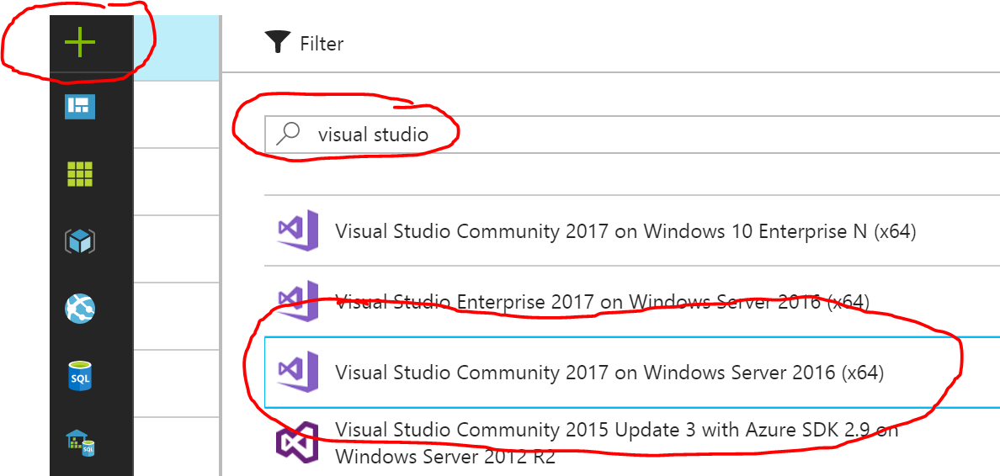

Once you've selected Create, you're presented with the typical VM creation form - fill it out, selecting a machine name, user and password you'll remember. 

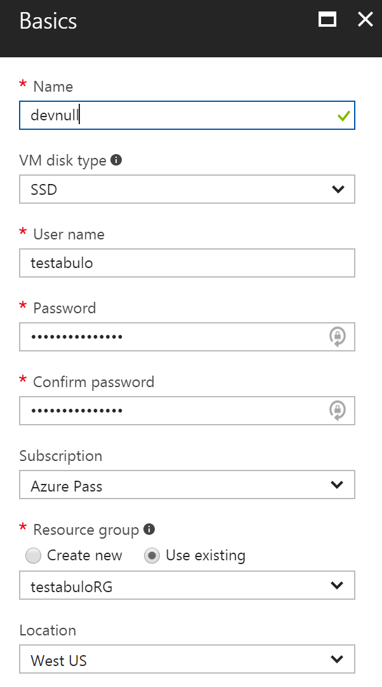

As far as VM size, let's use the default it gives us (D2_V2). Just hit ok on the next two screens to start creation, and wait for the VM to provision (should take roughly five minutes).

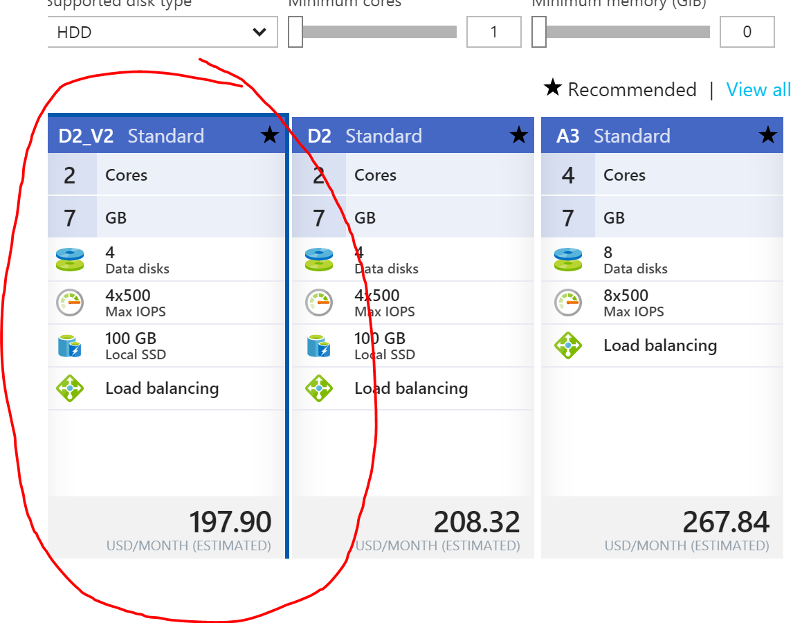

### Connecting to your VM ###

#### From a Windows PC ####

Once your VM is created, hit "Connect" and it will download an RDP configuration file that should allow you to connect to the machine. On Windows, MSTSC is already installed and will automatically open when you double-click that file, log in using the credentials you specified on creation, and you'll be presented with a new Windows VM. Load up Visual Studio using the Start menu and once you sign in and it gets through the initial "first time use" screen you should be ready to go.

#### From a Mac ####

If you're using a Mac you may need to install [Microsoft Remote Desktop from the App Store](https://itunes.apple.com/us/app/microsoft-remote-desktop/id715768417?mt=12), which will allow you to connect to the Windows VM you've created and use it as if you were sitting in front of it. Once you've got Remote Desktop running, click New to create a new connection, give your connection a name, and enter the Public IP address of your VM in the "PC name" field. You can enter your User name and Password too, if you want to have them automatically sent every time you log in. 

 

Close the "Edit remote desktops" window, then double-click your new connection to launch a remote desktop session to your VM. Load up Visual Studio using the Start menu and once you sign in and it gets through the initial "first time use" screen you should be ready to go.

### Loading the Project From Visual Studio ###

If you've never used Git from within Visual Studio, it is easy to clone and open solutions directly from within the tool. From the File menu, just choose Open->Open from Source Control:


and that will load a window allowing you to clone a GitHub repo (well, any remote repo) locally:


Once you've cloned, you should be able to navigate the directory using the Solution Explorer and open the .sln file you want.